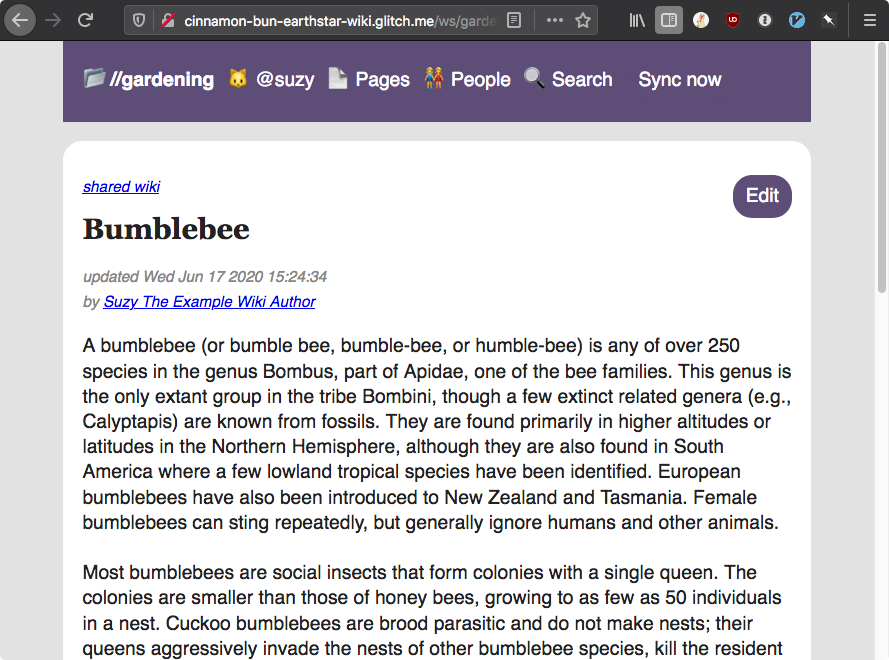

# Earthstar Wiki

An example app using [Earthstar](https://github.com/cinnamon-bun/earthstar) to hold a wiki.

## Live demo

### To do and notice

Click the "Sync now" button and watch new pages arrive from the pub servers.  Edit a page, or your username, and Sync again to send the changes back up to the pub servers.

### Live links

NOTE!  Some of these hosting services are unreliable.  But that's ok with Earthstar, everything is redundant -- any of these frontends or pub servers can go down, and the rest will keep working.  The data will be preserved.

Frontend mirrors:
* [netlify](https://earthstar-wiki.netlify.app/)
* [glitch.com](https://cinnamon-bun-earthstar-wiki.glitch.me/)
* [repl.it](https://earthstar-wiki--rabbitface.repl.co/)

Pub servers:
* [glitch 1](https://cinnamon-bun-earthstar-pub3.glitch.me/)
* [glitch 2](https://cinnamon-bun-earthstar-pub4.glitch.me/)
* [repl.it](https://earthstar-pub--rabbitface.repl.co/)

For now, you are logged in as a hardcoded user.  Proper login is implemented in Earthstar but the UI hasn't been finished yet.

## Screenshot

